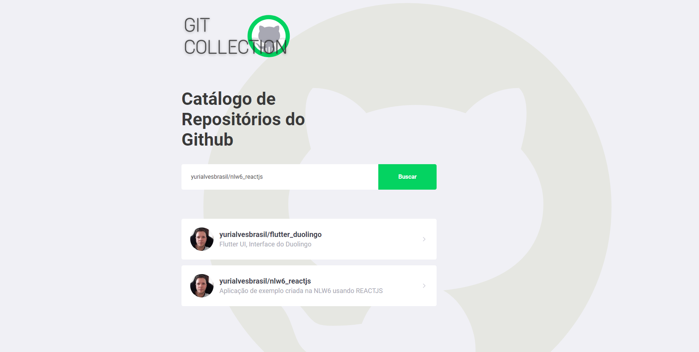

<h1 align="center">
  
</h1>

  

 

  

## ✨ Demonstração

- [Preview](https://yurigit.netlify.app/)

## ✨ Tecnologias

Esse projeto foi desenvolvido com as seguintes tecnologias:

- [React](https://reactjs.org)
- [Create-React-App](https://create-react-app.dev/)
- [TypeScript](https://www.typescriptlang.org/)

## 💻 Projeto

O GitCollection é um app para colecionar repositórios publicos do github.

## 🚀 Como executar

- Clone o repositório
- Instale as dependências com `yarn install`
- Inicie com `yarn start`

Agora você pode acessar [`localhost:3000`](http://localhost:3000) do seu navegador.

## 📄 Licença

Esse projeto está sob a licença MIT. Veja o arquivo [LICENSE](LICENSE.md) para mais detalhes.

---

Feito com ♥ by Yuri Brasil +55 (91)98401-8574 👋🏻
